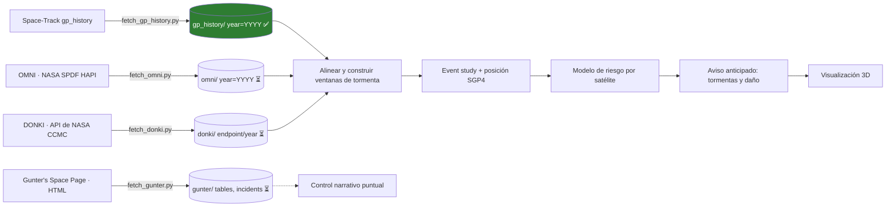

# CME Sentinel

> 🇬🇧 English version? → [README.md](README.md)

Proyecto de investigación histórica **eyección de masa coronal (CME) →
efecto satelital**: establecer, a partir de registros históricos, si las
erupciones solares afectan de forma medible a los objetos rastreados y a las
naves espaciales — **decaimiento orbital** por drag atmosférico impulsado por
tormentas y **fallas electrónicas** — como primer paso hacia el **aviso
anticipado** de tormentas y del **riesgo de daño por satélite**.

**Estado actual**

| Etapa | Datos | Estado |
|-------|-------|--------|
| 0 | Catálogo orbital `gp_history` de Space-Track (1960 → hoy) | ✅ descargado — 67.2 M de elementos, 63,762 objetos, 455 partes, ~12 GB |
| 1–3 | Colectores OMNI, DONKI, Gunter's | ⏳ scripts escritos y validados sintácticamente, **sin ejecutar** |
| 4 | Combinar datos, event study + SGP4 | ⏳ pendiente |

---

## Tabla de contenidos

- [1. Objetivo de investigación y cadena causal](#1-objetivo-de-investigación-y-cadena-causal)
- [2. El pipeline de datos](#2-el-pipeline-de-datos)
  - [2.1 Vista general del pipeline](#21-vista-general-del-pipeline)
  - [2.2 Etapa 0: Space-Track gp_history](#22-etapa-0-space-track-gp_history)
  - [2.3 Etapa 1: OMNI](#23-etapa-1-omni)
  - [2.4 Etapa 2: DONKI](#24-etapa-2-donki)
  - [2.5 Etapa 3: Gunter's](#25-etapa-3-gunters)
  - [2.6 Runbook](#26-runbook)
- [3. Cómo compaginamos los datos](#3-cómo-compaginamos-los-datos)
  - [3.1 Claves de empalme](#31-claves-de-empalme)
  - [3.2 Construcción de las ventanas de evento](#32-construcción-de-las-ventanas-de-evento)
  - [3.3 Tabla de análisis](#33-tabla-de-análisis)
  - [3.4 Validación: Starlink feb-2022](#34-validación-starlink-feb-2022)
- [4. Referencia: el catálogo orbital](#4-referencia-el-catálogo-orbital)
- [5. Fuentes excluidas y candidatas](#5-fuentes-excluidas-y-candidatas)
- [6. Visión: de la evidencia al aviso anticipado](#6-visión-de-la-evidencia-al-aviso-anticipado)
  - [6.1 Predicción de tormentas](#61-predicción-de-tormentas)
  - [6.2 Riesgo de daño por satélite](#62-riesgo-de-daño-por-satélite)
  - [6.3 Visualización 3D](#63-visualización-3d)
  - [6.4 Roadmap y advertencias](#64-roadmap-y-advertencias)
- [7. Requisitos y setup](#7-requisitos-y-setup)
- [8. Layout del proyecto](#8-layout-del-proyecto)

---

## 1. Objetivo de investigación y cadena causal

El objetivo de largo plazo de este repo es probar si las **CME afectan
causalmente a los satélites rastreados** y, en última instancia, dar un
**aviso anticipado** de dos cosas:

1. **Tormentas** — se observa una CME saliendo del Sol; queremos predecir el
   tiempo de llegada y la intensidad (Dst/Kp) de la tormenta geomagnética
   que producirá en la Tierra.
2. **Daño satelital** — **qué satélites específicos** están en riesgo:
   decaimiento orbital (drag) y daño electrónico (SEP), calculado desde la
   posición del satélite y la intensidad de tormenta pronosticada.

El camino es (a) descargar y alinear los datos históricos (§2–§3),
(b) probar la relación causal con un event study (§3) y luego (c) convertir
los patrones aprendidos en un predictor y una visualización 3D (§6).

Dos vías físicamente distintas conectan una CME en el Sol con un efecto
sobre un satélite:

| Vía | Cadena | Observable en el catálogo |
|-----|--------|---------------------------|
| Decaimiento orbital | CME → llega a la Tierra → **tormenta geomagnética** (Dst ↓, Kp ↑) → **calentamiento de la termósfera / densidad ↑** → **drag** ↑ → **decaimiento orbital** | `MEAN_MOTION` ↑, `PERIAPSIS` ↓, `DECAY_DATE` seteado (reentrada) |
| Falla electrónica | CME / SEP → **partículas solares energéticas** llegan a órbita → daño por radiación, **single-event upsets** | anomalías de telemetría / pérdida de señal (no visible en TLEs solos) |

El caso de validación canónico de todo el pipeline es el **lote de Starlink
perdido en febrero de 2022**: una tormenta geomagnética por CME engrosó la
termósfera y ~40 satélites Starlink reentraron en días — visible en el
catálogo como `DECAY_DATE` agrupados justo después de una tormenta fuerte.

---

## 2. El pipeline de datos

La obtención de datos se organiza en **cuatro etapas**, una por fuente. Cada
fuente cumple un rol fijo en la cadena causal. Todos los scripts de
recolección siguen las mismas convenciones (argparse con `--help`, logging,
retries con backoff exponencial, resume vía `data/.progress.json`, salida
en Parquet particionado por año).

### 2.1 Vista general del pipeline



| n | Fuente | Rol en la cadena | Colector | Artefacto | Estado |
|---|--------|------------------|----------|-----------|--------|
| 0 | Space-Track `gp_history` | **Efecto**: estado orbital, drag, decaimiento, reentrada | `fetch_gp_history.py` | `data/gp_history/year=YYYY/` | ✅ |
| 1 | OMNI (NASA SPDF) | **Driver continuo**: viento solar + Dst/Kp/protones | `fetch_omni.py` | `data/omni/year=YYYY/` | ⏳ |
| 2 | DONKI (NASA CCMC) | **Marco de eventos**: CME/GST/SEP/flares + cadenas causales | `fetch_donki.py` | `data/donki/<endpoint>/year=YYYY/` | ⏳ |
| 3 | Gunter's Space Page | **Capa narrativa**: estado/falla por satélite | `fetch_gunter.py` | `data/gunter/{tables,incidents}.parquet` + páginas crudas | ⏳ |

### 2.2 Etapa 0: Space-Track gp_history

**Qué aporta**: el archivo histórico completo de element sets de la US Space
Force — un **Orbit Mean-elements Message (CCSDS OMM)** por objeto rastreado
por época, **1960-01-01 → hoy**. 41 columnas: elementos orbitales,
coeficientes de drag/propagación, metadatos de misión y las líneas TLE
crudas (ver el diccionario de datos en §4.5).

**Rol**: el lado del **efecto** de la cadena — cómo responden las órbitas a
las tormentas (`MEAN_MOTION` ↑, `PERIAPSIS` ↓, `DECAY_DATE` seteado en
reentrada).

**Acceso**: API REST de Space-Track vía el paquete Python `spacetrack`
(login + sesión + rate limiting). Ya descargado localmente: **67.2 M de
element sets, 63,762 objetos distintos, 67 años, ~12 GB** en 455 partes
Parquet. Es un dataset de clase "1 / lifetime": descargar una vez, guardar
localmente, nunca re-ejecutar una descarga completa.

### 2.3 Etapa 1: OMNI

**Fuente**: NASA GSFC Space Physics Data Facility, servidor HAPI de CDAWeb,
dataset `OMNI_COHO1HR_MERGED_MAG_PLASMA`
(https://cdaweb.gsfc.nasa.gov/hapi) — DOI `10.48322/6ffx-3441`
(King & Papitashvili). Datos abiertos, CC0, sin clave.

**Qué aporta**: 1 fila por hora, **1963 → hoy** (~565,000 filas) — la
respuesta geomagnética/espacial continua que impulsa la vía del decaimiento
orbital. FMI (Bx/Bz/Bt), viento solar (velocidad, densidad, temperatura,
presión), índices (Dst, Kp, AE/AL/AU, ap, número de manchas solares, F10.7)
y flujos de protones energéticos (>1/>2/>4/>10/>30/>60 MeV):

| EPOCH | BZ_GSM (nT) | BGT (nT) | flow_speed (km/s) | proton_density (#/cm³) | DST (nT) | Kp | AE_INDEX (nT) | P<10MeV_flux |
|---|---|---|---|---|---|---|---|---|
| 2022-02-03 11:00 | −8.2 | 12.5 | 615 | 7.4 | −42 | 37 | 618 | 0.02 |
| 2022-02-03 12:00 | −15.4 | 18.9 | 689 | 9.1 | −85 | 57 | 1248 | 0.04 |
| 2022-02-03 13:00 | −19.8 | 22.1 | 702 | 10.2 | −112 | 73 | 1866 | 0.03 |

*Filas ilustrativas; el conjunto exacto de parámetros se resuelve en runtime
desde el endpoint `/info` de HAPI.*

**Por qué esta fuente**: OMNI es el dataset estándar 'L1-monopole' de la
comunidad de clima espacial: traslada las mediciones del viento solar a la
nariz del bow-shock terrestre y cose los índices definitivos de **Dst**,
**Kp** y **flujo de protones** en la misma grilla horaria — una sola tabla
contra la cual unir todo. También es la **señal de entrenamiento para la
predicción de tormentas** (§6.1).

### 2.4 Etapa 2: DONKI

**Fuente**: API pública de NASA `https://api.nasa.gov/DONKI/...` (Space
Weather Database Of Notifications, Knowledge, Information). Trabajo del
gobierno de EE. UU., dominio público. **Requiere una clave gratuita**
(https://api.nasa.gov) en `.env`:

```dotenv
NASA_API_KEY=your_nasa_api_key_here
```

**Qué aporta**: 1 fila por **evento** — el marco causal discreto (qué pasó
y cuándo). Endpoints obtenidos: `CME`, `CMEAnalysis`, `GST`, `FLR`, `SEP`,
`IPS`, `HSS`. Los registros son JSON con arreglos anidados que el script
aplana en columnas (los arreglos también se guardan serializados como JSON,
sin perder nada):

| activityID | startTime | sourceLocation | activeRegionNum | cmeAnalyses_speed_3d | cmeAnalyses_count | linked_activity_ids |
|---|---|---|---|---|---|---|
| 2022-02-01T17:00:00-CME-001 | 2022-02-01 17:00 | S24 | 12955 | 708 | 1 | [] |

| gstID | startTime | kpIndex | all_kp_max | linked_activity_ids |
|---|---|---|---|---|
| 2022-02-03T22:00:00-GST-001 | 2022-02-03 22:00 | 6.0 | 6.0 | [2022-02-01T17:00:00-CME-001] |

*(Filas ilustrativas; `linked_activity_ids` encadena CME → GST/SEP para
atribución.)*

**Por qué esta fuente**: DONKI suma lo que OMNI no puede — catálogos de CME
con **dirección 3D** (`cmeAnalyses[].speed_3d`, `isEarthDirected`),
declaraciones de tormentas geomagnéticas, eventos SEP/flare y las
**cadenas causa→efecto `linkedEvents`**, con timestamps en UTC real. Es el
**núcleo causal**: ancla NUESTRA definición de "hubo una tormenta porque
hubo una CME".

### 2.5 Etapa 3: Gunter's

**Fuente**: https://space.skyrocket.de (G. Krebs) — páginas HTML, sin API.
Referencia **secundaria** curada: estado y causa de falla por satélite,
incluidas las narrativas de fallas de comsats en texto libre.

**Qué aporta**: dos tablas extraídas más las páginas crudas:

1. **Tablas de índice** → `data/gunter/tables.parquet` (filas extraídas de
   las tablas de directorio de satélites):

| satellite | cospar | date | ls | launch vehicle | remarks | source_url |
|---|---|---|---|---|---|---|
| GOES 9 (GOES J) | 1995-025A | 23.05.1995 | CC LC-36B | Atlas-1 | | https://space.skyrocket.de/doc_sdat/goes-i.htm |

2. **Narrativas de fallas de comsats** → `data/gunter/incidents.parquet`
   (pares encabezado + texto de las páginas `doc_sat/comsat_failures*`):

| satellite | text | source_url |
|---|---|---|
| DirecTV-6 | "…fue víctima de una llamarada solar en abril de 1997 que dejó fuera tres transponders…" | https://space.skyrocket.de/doc_sat/comsat_failures.htm |

3. **Contenido crudo** → `data/gunter/pages/<page_id>.html` y `.txt`, más
   un mapa del crawl `data/gunter/meta/pages.parquet` — para poder mejorar
   el parseo sin re-crawlear.

**Por qué esta fuente**: es lo más cercano a un registro de "por qué dejó de
funcionar este satélite específico" (las fechas son reales pero gruesas,
p. ej. "abril de 1997", y las causas son prosa) — útil para **ilustrar y
validar** casos, no para estadística poblacional. Es la capa narrativa extra
para validar Starlink feb-2022 y un **control puntual** del análisis de §3,
deliberadamente **fuera** del modelo central de event study.

### 2.6 Runbook

Ejecutar los colectores **en orden de etapa** (OMNI primero — es el driver
continuo — después DONKI, y por último Gunter's, que es el más lento). Cada
script resume de forma segura desde `data/.progress.json`; `--reset` es solo
para re-descargas intencionales. `--help` en cualquier script da las
opciones completas. Pruebas: `--limit 1` (OMNI/DONKI) o `--max-pages 10`
(Gunter's).

```bash
# Etapa 0 (hecha): catálogo orbital
python scripts/fetch_gp_history.py

# Etapa 1: OMNI horario, 1963 → hoy
python scripts/fetch_omni.py

# Etapa 2: eventos DONKI, 2010 → hoy (requiere NASA_API_KEY)
python scripts/fetch_donki.py

# Etapa 3: crawl completo de Gunter's (resume-safe)
python scripts/fetch_gunter.py
```

| Etapa | Comando | Necesita | Salida | Volumen esperado | Tiempo esperado |
|-------|---------|----------|--------|------------------|-----------------|
| 0 | `fetch_gp_history.py` | credenciales Space-Track | `data/gp_history/` | ~12 GB | ya hecho |
| 1 | `fetch_omni.py` | nada | `data/omni/` | unos cientos de MB | minutos–1 h |
| 2 | `fetch_donki.py` | `NASA_API_KEY` | `data/donki/` | unos pocos MB | minutos |
| 3 | `fetch_gunter.py` | nada | `data/gunter/` | ~100–200 MB | ~2 h (5000 páginas @ 1.5 s) |

**Advertencias aplicadas** (guardadas en los scripts): el host HAPI de OMNI
que funciona es `cdaweb.gsfc.nasa.gov/hapi` (`spdf.gsfc.nasa.gov/hapi`
devuelve 403); los valores de relleno de OMNI (`-1e31`) se convierten a
`NaN`; cada fuente vive en su subcarpeta bajo `data/` con sus claves de
progreso propias (`omni:YYYY`, `donki:<endpoint>:YYYY`,
`gunter:page:<sha1>`).

---

## 3. Cómo compaginamos los datos

Esta es la metodología que convierte cuatro datasets separados en un solo
análisis coherente. Los umbrales de abajo son **provisionales** — existen
para que el procedimiento sea preciso y se ajustarán durante la fase de
análisis.

### 3.1 Claves de empalme

| Fuente | Granularidad | Columna(s) clave | Qué alinea |
|--------|--------------|-------------------|------------|
| OMNI | 1 h | `EPOCH` | el **eje temporal maestro** |
| DONKI | evento | `startTime`, `endTime`, `linked_activity_ids` | eventos sobre el eje temporal + atribución CME→GST |
| gp_history | por objeto por época | `EPOCH`, `NORAD_CAT_ID`, `DECAY_DATE` | estado de un objeto en cualquier tiempo |
| Gunter's | por lanzamiento | `cospar`, `date` | mapear a objeto vía COSPAR/match + fecha de lanzamiento (prosa) |

`NORAD_CAT_ID` (de gp_history) es la clave primaria a nivel objeto; las
tablas de Gunter's usan designadores COSPAR y fechas de lanzamiento, así que
la unión con el catálogo orbital es difusa (mismo objeto vía `OBJECT_ID` =
COSPAR, o por nombre + fecha de lanzamiento). DISCOSweb de ESA podría dar
después un puente exacto de objetos.

### 3.2 Construcción de las ventanas de evento

1. **Catálogo de tormentas desde OMNI** — marcar cada fila horaria como
   tormentosa si `DST ≤ −50 nT` (umbral de tormenta magnética) **o**
   `Kp ≥ 5` (nivel G-tormenta); agrupar horas tormentosas contiguas en
   eventos (duración mínima 3 h, tolerancia de hueco 6 h). Cada evento
   recibe `storm_id`, `storm_start`, `storm_peak` (hora de Dst mín / Kp
   máx), `dst_min`, `kp_max`.
2. **Plegar la atribución DONKI** — empalmar cada tormenta OMNI con un GST
   de DONKI por `startTime` en **±24 h**; luego seguir los
   `linked_activity_ids` del GST hasta la(s) **CME(s) padre** (cono 3D:
   velocidad, dirección, `isEarthDirected`). Los eventos SEP (vía
   electrónica) se empalman igual.
3. **Ventanas orbitales por objeto** — para cada `NORAD_CAT_ID` con TLEs
   alrededor de la tormenta, definir la **ventana de evento**
   `[storm_start − 7 d, storm_end + 7 d]` y el **baseline**
   `[storm_start − 30 d, storm_start − 7 d]`. Agregar `MEAN_MOTION` y
   `PERIAPSIS` diariamente por objeto.
4. **Features de respuesta** — para cada (objeto, tormenta): Δ`MEAN_MOTION`
   y Δ`PERIAPSIS` (promedio del evento menos promedio del baseline), flag
   `decay_in_window` (`DECAY_DATE` dentro de la ventana; recordá que los
   objetos activos tienen `DECAY_DATE = ""`, filtrar con
   `.astype(str).ne("")`), y `hours_peak_to_decay`.
5. **Posición exacta con SGP4** — propagar el **TLE más cercano** de cada
   objeto (dentro de ±7 d del pico de tormenta) al pico con `sgp4` →
   posición exacta, semieje mayor y perigeo en el momento de la tormenta.
   Registrar `propagator_age_days` (el error de SGP4 crece con la edad del
   TLE; Starlink actualiza TLEs ~6×/día, los objetos viejos mucho menos).
6. **Event study poblacional** — OLS de efectos fijos (objeto × tormenta) de
   las features de respuesta contra la intensidad (`dst_min`, `kp_max`) y
   covariables sensibles al drag (altitud de apogeo, inclinación). Es el
   núcleo causal del proyecto.
7. **Control narrativo** — para los satélites marcados, buscar en Gunter's
   (`cospar`/`date`) para leer/confirmar en prosa; nunca usar las
   estadísticas de Gunter's en el modelo.

### 3.3 Tabla de análisis

El resultado de §3.2 es una tabla long-format, **una fila por objeto por
tormenta**:

| Columna | Significado |
|---------|-------------|
| `NORAD_CAT_ID` | objeto (de gp_history) |
| `storm_id`, `storm_peak_utc` | el evento de tormenta OMNI |
| `dst_min`, `kp_max` | intensidad de la tormenta |
| `cme_activity_id` | CME padre de DONKI (o `None`) |
| `window_start`, `window_end` | límites de la ventana de evento |
| `delta_mean_motion`, `delta_periapsis` | respuesta orbital |
| `decay_in_window` (bool), `decay_utc` | reentrada dentro de la ventana |
| `sgp4_alt_km`, `sgp4_perigee_km` | posición exacta en el pico de tormenta |
| `propagator_age_days` | edad del TLE al propagar (proxy del error SGP4) |
| `gunter_hit` | match narrativo encontrado en Gunter's (bool) |

Esta tabla es también el **feature store** para el modelo de riesgo de §6.

### 3.4 Validación: Starlink feb-2022

Caso de validación que todo el pipeline debe reproducir antes de confiar en
él:

- **Evento**: CME de ~1–2 feb 2022 → GST fuerte del ~3–4 feb 2022. En el
  catálogo descargado, **75 objetos muestran `DECAY_DATE` en febrero de
  2022**, incluidos payloads de Starlink — el cluster esperado.
- **Chequeos**: la tormenta debe detectarse en el paso 1 de §3.2
  (`dst_min`/`kp_max` extremos); DONKI debe atribuir un GST a una CME con
  `isEarthDirected`; los objetos que decaen deben tener
  `decay_in_window = True`, Δ`MEAN_MOTION` alto y desorbitado días antes del
  decaimiento; Gunter's debería contener la narrativa ("Starlink… destruidos
  por la tormenta").
- **Advertencia**: Starlink también desciende operativamente; el event study
  necesita el baseline pre-tormenta para separar el decaimiento por tormenta
  de la reentrada rutinaria.

---

## 4. Referencia: el catálogo orbital

Todo el detalle profundo del catálogo `gp_history` ya descargado.

### 4.1 Cómo funciona la fuente de datos

Space-Track.org es el sitio de la US Space Force / 18th Space Defense
Squadron que publica los datos no clasificados de conciencia situacional
espacial. Su API REST:

- **Login**: `POST https://www.space-track.org/ajaxauth/login` con
  `identity` + `password` (campos de formulario). La respuesta setea una
  cookie de sesión que debe enviarse en las peticiones siguientes.
- **Query**: `GET /basicspacedata/query/class/gp_history/<PREDICATE>.../<format>`
- **Predicados** con operadores: `>` (mayor que), `<` (menor que), `--`
  (rango), listas separadas por coma y tiempos relativos como `>now-10`. Un
  filtro de rango de fechas se escribe `EPOCH/1960-01-01--1960-12-31/`.
- **Formatos**: `xml`, `kvn`, `json`, `csv`, `tle`, `3le`, `html`.

El paquete Python `spacetrack` (usado por este proyecto) envuelve todo lo
anterior: hace el login, mantiene la cookie de sesión, valida predicados y
aplica el límite de **30 requests / minuto** automáticamente.

### 4.2 Por qué el descargador divide el rango en ventanas

Una sola query no puede devolver todo el archivo: el servidor da timeout en
rangos de fechas enormes y las pautas de la API limitan qué tan rápido se
puede consultar. La herramienta lo resuelve así:

1. Divide el rango 1960→hoy en **ventanas de tiempo** (lo suficientemente
   chicas como para que cada request tenga éxito).
2. Descarga cada ventana **como CSV** (el formato más compacto) y la
   **streamea línea por línea**, para que la memoria se mantenga acotada.
3. **Divide automáticamente** cualquier ventana demasiado grande hasta que
   entre.
4. Guarda el resultado como **Parquet particionado por año**, listo para
   análisis rápido con pandas/polars.

No se aplica filtrado: **se descarga todo**. El filtrado (p. ej. solo LEO,
solo payloads, solo objetos decaídos) se hace luego al consultar.

### 4.3 Detalle del descargador

Ejecutar con:

```bash
python scripts/fetch_gp_history.py
```

- **Login y sesión** — `SpaceTrackClient(identity, password)` hace login
  lazy en la primera petición; el script cierra la sesión limpiamente.
- **Ventanas de tiempo** — todo el rango se divide en intervalos cerrados
  contiguos y sin solapamiento. El tamaño depende de la era: 1 mes
  (2020→hoy, era Starlink), 3 meses (2016–2019), 6 meses (2008–2015),
  1 año (<2008).
- **Streaming** — cada ventana se pide con `format="csv"`,
  `orderby="EPOCH"`, `iter_lines=True`; las líneas se acumulan en batches de
  `--batch-size` (por defecto 200 000) y cada batch se escribe al instante
  como su propia parte Parquet:
  `data/gp_history/year=YYYY/part-<fecha>-<batch>.parquet`. Un
  `--min-interval` cortés (por defecto 2 s) duerme antes de cada request,
  con backoff exponencial ante fallas transitorias.
- **Auto-subdivisión** — una ventana que falla se parte por la mitad y se
  reintenta, hasta un mínimo de 1 día (profundidad 10).
- **Resume** — las ventanas completadas se registran en
  `data/.progress.json`; las corridas interrumpidas se saltan al reiniciar.
  `--reset` ignora el progreso guardado (usar solo intencionalmente: es un
  dataset "1 / lifetime").
- **Salida** — una carpeta por año calendario, una parte por batch, todas
  con el mismo esquema, más una columna entera `year` de conveniencia.

### 4.4 Datos de muestra por era

Las cinco columnas `ECCENTRICITY`, `INCLINATION`, `MEAN_MOTION`, `PERIAPSIS`
y `APOAPSIS` son las más útiles para ojear rápido cómo se mueve un satélite.
Abajo hay **filas reales** de los datos descargados.

#### 1960 – los albores de la era espacial

Solo **51 objetos distintos** se rastreaban en 1960 (737 element sets).
Todos son sondas tempranas de EE. UU., etapas superiores y sus escombros.

| EPOCH | OBJECT_NAME | NORAD_CAT_ID | OBJECT_TYPE | OBJECT_ID | COUNTRY | ECCENTRICITY | INCLINATION (°) | MEAN_MOTION (rev/day) | PERIAPSIS (km) | APOAPSIS (km) | LAUNCH_DATE | DECAY_DATE | RCS_SIZE | SITE   |
|-------|-------------|--------------|-------------|-----------|---------|--------------|-----------------|-----------------------|----------------|---------------|-------------|------------|----------|--------|
| 1960-01-01 23:52:39 | VANGUARD R/B | 12 | ROCKET BODY | 1959-001B | US | 0.184 | 32.9 | 11.09 | 554 | 3,681 | 1959-02-17 | | MEDIUM | AFETR |
| 1960-01-02 11:15:40 | JUNO II R/B | 23 | ROCKET BODY | 1959-009B | US | 0.037 | 50.3 | 14.22 | 552 | 1,084 | 1959-10-13 | 1989-07-16 | MEDIUM | AFETR |
| 1960-01-02 12:02:07 | EXPLORER 7 | 22 | PAYLOAD | 1959-009A | US | 0.037 | 50.3 | 14.20 | 560 | 1,087 | 1959-10-13 | | MEDIUM | AFETR |

Nótese la alta excentricidad de la etapa Vanguard (0.184 → apogeo de
3,681 km) y que las órbitas son elípticas; la mayoría de los objetos de los
60 tenían baja inclinación (32–50°).

#### 1980 – el catálogo de la guerra fría

Para 1980 Estados Unidos, la URSS (`CIS`) y Francia (`FR`) estaban todas en
el espacio — **4,580 objetos distintos** (501,840 filas). Los campos de
escombros crecían rápido tras los rompimientos de los 60-70.

| EPOCH | OBJECT_NAME | NORAD_CAT_ID | OBJECT_TYPE | OBJECT_ID | COUNTRY | ECCENTRICITY | INCLINATION (°) | MEAN_MOTION (rev/day) | PERIAPSIS (km) | APOAPSIS (km) | LAUNCH_DATE | DECAY_DATE | RCS_SIZE | SITE   |
|-------|-------------|--------------|-------------|-----------|---------|--------------|-----------------|-----------------------|----------------|---------------|-------------|------------|----------|--------|
| 1980-01-01 00:00:09 | SCOUT X-3 DEB (YO) | 523 | DEBRIS | 1962-071D | US | 0.005 | 90.5 | 14.84 | 583 | 648 | 1962-12-19 | 1980-11-30 | SMALL | AFWTR |
| 1980-01-01 00:00:18 | DELTA 1 R/B | 3094 | ROCKET BODY | 1968-002B | US | 0.032 | 105.8 | 12.84 | 1,081 | 1,570 | 1968-01-11 | | MEDIUM | AFWTR |
| 1980-01-01 00:01:10 | COSMOS 469 | 5721 | PAYLOAD | 1971-117A | CIS | 0.002 | 64.5 | 13.75 | 966 | 995 | 1971-12-25 | | LARGE | TTMTR |

Notá las órbitas casi circulares (excentricidades de 0.002–0.032), la etapa
retrógrada Delta a 105° y el payload soviético `COSMOS` — el catálogo ya es
verdaderamente internacional e incluye escombros longevos (los escombros del
SCOUT X-3 aún se rastreaban 18 años después del lanzamiento).

#### 2010 – la era pre-megaconstelación

2010 tiene **14,951 objetos distintos** (1,015,278 filas). Satélites GEO,
misiones científicas de alta excentricidad y la nube de escombros de la
prueba ASAT china de 2007 (Fengyun-1C) se rastreaban todos juntos.

| EPOCH | OBJECT_NAME | NORAD_CAT_ID | OBJECT_TYPE | OBJECT_ID | COUNTRY | ECCENTRICITY | INCLINATION (°) | MEAN_MOTION (rev/day) | PERIAPSIS (km) | APOAPSIS (km) | LAUNCH_DATE | DECAY_DATE | RCS_SIZE | SITE   |
|-------|-------------|--------------|-------------|-----------|---------|--------------|-----------------|-----------------------|----------------|---------------|-------------|------------|----------|--------|
| 2010-01-01 00:00:00 | THEMIS D | 30797 | PAYLOAD | 2007-004D | US | 0.751 | 3.6 | 1.00 | 4,125 | 67,437 | 2007-02-17 | | MEDIUM | AFETR |
| 2010-01-01 00:00:00 | INTELSAT 15 | 36106 | PAYLOAD | 2009-067A | ITSO | 0.000 | 0.0 | 1.01 | 35,664 | 35,688 | 2009-11-30 | | LARGE | TTMTR |
| 2010-01-01 00:00:13 | FENGYUN 1C DEB | 33710 | DEBRIS | 1999-025DGX | PRC | 0.006 | 99.3 | 13.98 | 856 | 947 | 1999-05-10 | | SMALL | TSC |

Esta era lo tiene todo: una órbita científica muy elíptica (THEMIS D:
excentricidad 0.75, apogeo ~67,000 km), un satélite **geoestacionario** a
35,700 km con `MEAN_MOTION ≈ 1 rev/day`, y escombros de la prueba ASAT
Fengyun-1C (designación china `PRC`).

#### 2024 – la era Starlink

Para 2024 el catálogo explotó a **29,814 objetos distintos** (6.36 millones
de filas). La mayoría de los objetos nuevos son payloads Starlink — satélites
LEO pequeños, casi circulares, lanzados solo meses antes.

| EPOCH | OBJECT_NAME | NORAD_CAT_ID | OBJECT_TYPE | OBJECT_ID | COUNTRY | ECCENTRICITY | INCLINATION (°) | MEAN_MOTION (rev/day) | PERIAPSIS (km) | APOAPSIS (km) | LAUNCH_DATE | DECAY_DATE | RCS_SIZE | SITE   |
|-------|-------------|--------------|-------------|-----------|---------|--------------|-----------------|-----------------------|----------------|---------------|-------------|------------|----------|--------|
| 2024-01-01 00:00:00 | STARLINK-6068 | 56798 | PAYLOAD | 2023-078AH | US | 0.000 | 70.0 | 14.98 | 570 | 574 | 2023-05-31 | | LARGE | AFWTR |
| 2024-01-01 00:00:00 | STARLINK-30550 | 58045 | PAYLOAD | 2023-156T | US | 0.000 | 53.0 | 15.92 | 296 | 298 | 2023-10-09 | | LARGE | AFWTR |
| 2024-01-01 00:00:00 | STARLINK-30951 | 58439 | PAYLOAD | 2023-183C | US | 0.000 | 43.0 | 15.26 | 487 | 489 | 2023-11-28 | | LARGE | AFETR |

Los satélites Starlink son esencialmente circulares (excentricidad
~0.0001-0.0003), en varios shells de inclinación (43°, 53°, 70°), con mean
motions de 15–16 rev/day (periodos de ~90–96 minutos) y altitudes de ~300–600
km.

### 4.5 Diccionario de datos (qué significa cada variable)

Cada fila del catálogo es un **Orbit Mean-elements Message (CCSDS OMM)**:
una foto de la órbita de un objeto en `EPOCH`. Las 41 columnas caen en ocho
grupos semánticos.

**1. Identificación del objeto**

| Columna | Tipo Parquet | Significado |
|---------|--------------|-------------|
| `OBJECT_NAME` | string | Nombre común público, p. ej. `ISS (ZARYA)`, `STARLINK-6068`, `COSMOS 469`. |
| `OBJECT_ID` | string | Designador internacional (COSPAR): `YYYY-NNNx`, p. ej. `1998-067A`. |
| `NORAD_CAT_ID` | int | **Número de catálogo** único emitido por la US Space Force (25544 = ISS). Clave primaria del objeto. |
| `OBJECT_TYPE` | string | `PAYLOAD`, `ROCKET BODY`, `DEBRIS`, `TBA`/`UNKNOWN`. |
| `CLASSIFICATION_TYPE` | string | Clasificación de seguridad, casi siempre `U` (no clasificado). |

**2. Elementos orbitales clásicos** — con `EPOCH` y estos cinco definen
completamente el estado; `MEAN_ANOMALY` es el "dónde a lo largo de la
órbita".

| Columna | Tipo Parquet | Significado |
|---------|--------------|-------------|
| `EPOCH` | datetime (UTC) | **Tiempo del element set** — el instante en que estos elementos son válidos. |
| `MEAN_MOTION` | float | **Mean motion**, rev/día. ~15.9 = ISS (LEO), ~1.0 = GEO, ~14.8 = Starlink. |
| `ECCENTRICITY` | float | **Excentricidad orbital**, 0 = círculo perfecto. |
| `INCLINATION` | float | **Inclinación**, grados. 0° = ecuatorial, 51.6° = ISS, 97°+ = heliosíncrona, >90° = retrógrada. |
| `RA_OF_ASC_NODE` | float | **Ascensión recta del nodo ascendente**, grados (0–360). |
| `ARG_OF_PERICENTER` | float | **Argumento de perigeo**, grados (0–360). |
| `MEAN_ANOMALY` | float | **Anomalía media**, grados (0–360) — dónde en la elipse en la época. |

**3. Coeficientes de propagación SGP4**

| Columna | Tipo Parquet | Significado |
|---------|--------------|-------------|
| `BSTAR` | float | **Coeficiente de drag / presión de radiación** (1/radios-terrestres). Negativo indica presión de radiación. |
| `MEAN_MOTION_DOT` | float | Primera derivada del mean motion, rev/día² (tasa de encogimiento orbital). |
| `MEAN_MOTION_DDOT` | float | Segunda derivada del mean motion, rev/día³ (casi siempre 0). |
| `EPHEMERIS_TYPE` | int | Modelo de efemérides usado en la generación (0 = SGP4 en la práctica). |
| `ELEMENT_SET_NO` | int | Número de revisión de este element set para el objeto. |
| `REV_AT_EPOCH` | int | **Número de órbita en la época** — revoluciones completas desde el lanzamiento. |

**4. Parámetros orbitales derivados** (calculados por Space-Track)

| Columna | Tipo Parquet | Significado |
|---------|--------------|-------------|
| `SEMIMAJOR_AXIS` | float | **Semieje mayor**, km. |
| `PERIOD` | float | **Periodo orbital**, minutos. ~90–96 min LEO, 1436 min GEO. |
| `APOAPSIS` | float | **Altitud de apogeo**, km sobre el nivel del mar. |
| `PERIAPSIS` | float | **Altitud de perigeo**, km sobre el nivel del mar. Perigeo ≤ 2,000 km ≈ LEO. |

**5. Metadatos de misión**

| Columna | Tipo Parquet | Significado |
|---------|--------------|-------------|
| `LAUNCH_DATE` | string (`YYYY-MM-DD`) | Cuándo despegó el vehículo lanzador del objeto. |
| `DECAY_DATE` | string (`YYYY-MM-DD`) | Cuándo reentró el objeto (**vacío `""` si aún está en órbita**). |
| `SITE` | string | Código del sitio de lanzamiento, p. ej. `AFETR`, `AFWTR`, `TTMTR`, `TSC`. |
| `COUNTRY_CODE` | string | País/organización, p. ej. `US`, `CIS`, `PRC`, `ITSO`. |
| `RCS_SIZE` | string | Clase de sección transversal de radar: `SMALL`, `MEDIUM`, `LARGE`. |

**6. Metadatos de API / data frame**

| Columna | Tipo Parquet | Significado |
|---------|--------------|-------------|
| `CCSDS_OMM_VERS` | string | Versión del formato OMM (p. ej. `3.0`). |
| `COMMENT` | string | Comentario libre, p. ej. `GENERATED VIA SPACE-TRACK.ORG API`. |
| `CREATION_DATE` | datetime (UTC) | Cuándo 18 SPCS generó/publicó este element set. |
| `ORIGINATOR` | string | Agencia creadora, p. ej. `18 SPCS`. |
| `CENTER_NAME` | string | Cuerpo central, `EARTH`. |
| `REF_FRAME` | string | Marco de referencia, `TEME`. |
| `TIME_SYSTEM` | string | Sistema de tiempo, `UTC`. |
| `MEAN_ELEMENT_THEORY` | string | Teoría del propagador, `SGP4`. |
| `FILE` | int | ID del archivo de origen subido a Space-Track (mayor = batch más reciente). |
| `GP_ID` | int | **Identificador de fila único** en el archivo GP. |

**7. Líneas TLE crudas** (forma exacta en string, mejor para tu propia
propagación SGP4)

| Columna | Tipo Parquet | Significado |
|---------|--------------|-------------|
| `TLE_LINE0` | string | Línea 0: la línea con el nombre del objeto (`0 NAME`). |
| `TLE_LINE1` | string | Número de catálogo, clasificación, datos de época, términos de drag, nro. de element set, checksum. |
| `TLE_LINE2` | string | Inclinación, RAAN, excentricidad (comprimida), arg. perigeo, anomalía media, mean motion, checksum. |

**8. Columna de partición**

| Columna | Tipo Parquet | Significado |
|---------|--------------|-------------|
| `year` | int | Columna de conveniencia agregada por el descargador, igual al año de `EPOCH`. |

En los archivos Parquet las columnas numéricas se guardan como floats de 64
bits / enteros Int64 (nullable) y `EPOCH` / `CREATION_DATE` como
`datetime64[ns, UTC]` con zona horaria. La precisión de timestamp puede
alternar entre microsegundos y milisegundos entre límites de año; ambas
unifican limpiamente al leer.

### 4.6 Lectura de los datos

```python
import pandas as pd

# Leer el catálogo completo como un solo DataFrame (puede tardar / usar
# bastante RAM para la historia completa). Para análisis grandes, leer un
# año a la vez.
df = pd.read_parquet("data/gp_history")
df_2024 = pd.read_parquet("data/gp_history/year=2024")

# Último elset de la ISS:
iss = df[df["NORAD_CAT_ID"] == 25544].sort_values("EPOCH").tail(1)

# Ejemplo LEO (perigeo bajo 2000 km):
leo = df[df["PERIAPSIS"] <= 2000.0]

# Solo payloads Starlink:
starlink = df[df["OBJECT_NAME"].str.startswith("STARLINK")]

# Solo objetos activos (no decaídos): DECAY_DATE es "" para objetos activos
# (ver §3.2 paso 4), entonces:
active = df[df["DECAY_DATE"].astype(str).ne("")]
```

Los otros datasets se leen igual:

```python
omni = pd.read_parquet("data/omni")              # viento solar e índices horarios
donki_cme = pd.read_parquet("data/donki/CME")    # una fila por CME
donki_gst = pd.read_parquet("data/donki/GST")    # una fila por tormenta
gunter_tables = pd.read_parquet("data/gunter/tables.parquet")
gunter_incidents = pd.read_parquet("data/gunter/incidents.parquet")
```

### 4.7 Verificación

```bash
python - <<'EOF'
import pandas as pd
df = pd.read_parquet("data/gp_history")
print(df.groupby("year")["NORAD_CAT_ID"].count())          # filas por año
print(df.groupby("year")["EPOCH"].agg(["min", "max"]))     # cobertura por año
print(df.groupby("year")["NORAD_CAT_ID"].nunique().max())  # objetos distintos
EOF
```

Chequeo profundo opcional: recalcular el checksum módulo 10 de `TLE_LINE1`/
`TLE_LINE2` para confirmar la integridad del TLE crudo (Space-Track asigna 0
a letras/blancos/`.`/`+` y 1 a `-`).

### 4.8 Consideraciones, rate limits y política

- **Volumen**: el archivo completo es de **~138M+ element sets** → decenas
  de GB de Parquet, y una descarga que puede tardar **horas o días**. La
  descarga local actual es de **67.2M filas / ~12 GB**.
- **Throttle de la API**: Space-Track limita a **<30 requests/minuto** y
  **<300 requests/hora**. El cliente `spacetrack` aplica el límite por
  minuto; el script está diseñado para que el total de requests quede muy
  por debajo de 300 (un request por ventana).
- **Política de clase de datos**: las pautas etiquetan a `GP_HISTORY` como
  "1 / lifetime" — descargar una vez y **guardar en tus propios servidores**
  (exactamente lo que hace este proyecto). No re-ejecutar descargas
  completas; `--reset` debe usarse solo intencionalmente.
- **Recomendado**: antes de una descarga masiva, contactar a
  [Space-Track](https://www.space-track.org/documentation) (Contact Us) para
  anunciar el plan y confirmar uso aceptable.
- **Redistribución**: USSPACECOM da aprobación global para redistribuir
  datos SSA básicos con la cita apropiada (`USSPACECOM/18 SDS`).
- **Zona horaria**: todos los timestamps son **UTC**.

---

## 5. Fuentes excluidas y candidatas

### 5.1 ESA Anomaly Dataset (referencia documentada, excluida)

El [ESA Anomaly Dataset](https://github.com/esa/anomaly-dataset) es el primer
dataset a gran escala de **telemetría real de satélites** (housekeeping:
corrientes, voltajes, temperaturas, estados) con **anotaciones de anomalías
curadas por ingenieros de operaciones de misión de ESA**. Fue producido por
Airbus Defence and Space, KP Labs y ESA/ESOC bajo la hoja de ruta A²I.

- Data: Zenodo `10.5281/zenodo.12528696` (3 zips, ~11.6 GB)
- Paper: arXiv [`2406.17826`](https://arxiv.org/abs/2406.17826); versión en
  revista [DMLR](https://data.mlr.press/assets/pdf/v03-23.pdf)
- Código del benchmark: [`kplabs-pl/ESA-ADB`](https://github.com/kplabs-pl/ESA-ADB)
  (pipeline basado en TimeEval; Kaggle: `esa-adb-challenge`)

| | Mission1 | Mission2 | Mission3 |
|---|---|---|---|
| Canales (target) | 76 (58) | 100 (47) | 48 (24) |
| Telecomandos | 698 | 123 | 0 |
| Duración (anonimizada) | 14 a | 3.5 a | 8 a |
| Data points | ~775 M | ~777 M | ~745 M |
| Anotados (%) | 1.80 | 0.58 | 1.03 |
| Eventos | 200 | 644 | 586 |
| Anomalías | 118 | 31 | 8 |
| Rare nominal events | 78 | 613 | 25 |
| Gaps / inválidos | 4 / 0 | 0 / 0 | 397 / 156 |

Cada carpeta de misión trae `channels/<param>.zip` (series por canal),
`telecommands/<tc>.zip`, `labels.csv` y `anomaly_types.csv` (`Anomaly` /
`Rare Event` / `Gap`). La Mission3 está excluida del benchmark upstream
(anomalías triviales).

> **Por qué no está en el pipeline causal**: el dataset está totalmente
> anonimizado — nombres de canales, identidad de la misión **y el eje
> temporal**. El paper declara que la anonimización *impide esperar anomalías
> en momentos específicos, p. ej. durante actividad solar aumentada*. Como
> los timestamps no pueden alinearse con los tiempos de tormenta de
> DONKI/OMNI, este dataset **no puede** contribuir al estudio de correlación
> de CME. Se documenta aquí como el benchmark de referencia para detección
> de anomalías en telemetría de naves, por si alguna vez se agrega un módulo
> de anomalías de telemetría.

### 5.2 Estado de satélites y causa de falla (capas extra)

| Fuente | Aporta | Rol |
|--------|--------|-----|
| **Gunter's Space Page** (`space.skyrocket.de`) | **Estado y causa de falla** por satélite (p. ej. "falló en 1998 por problemas de rueda de momento") | Capa narrativa para validación puntual (ver §2.5, §3.4) |
| **DISCOSweb** (ESA) | Metadatos de objeto + `reentryEpoch`, lanzamientos, fragmentaciones, reentradas | API REST (cuenta) — complementa los metadatos de Space-Track y podría ser un puente exacto COSPAR↔NORAD |
| **UCS Satellite Database** | Estado operativo actual (Operational / Non-operational) | Foto de "vivo hoy", sin historial de fallas |

La atribución de clima espacial viene de **DONKI (GST/SEP) + OMNI
(Dst/Kp/protones) + eventos de decaimiento en Space-Track**; estas capas solo
responden "por qué dejó de funcionar este satélite específico".

### 5.3 Catálogos históricos candidatos (evaluados, no adoptados)

| Catálogo | Cobertura | Nota |
|----------|-----------|------|
| CDAW/SOHO-LASCO CME | 1996+ | Catálogo de CME de larga duración |
| CACTus (SOHO) | 1997–2017 | Detección automática de CME |
| HELCATS (STEREO) | 2007–2017 | Tracking 3D de CME desde los STEREO gemelos |

DONKI/OMNI fueron elegidos como el núcleo porque DONKI agrega dirección 3D
real, eventos SEP/GST y cadenas causales, y OMNI carga la serie continua de
Dst/Kp/protones.

---

## 6. Visión: de la evidencia al aviso anticipado

El pipeline de datos y el event study (§2–§3) establecen la **causalidad
histórica**. El siguiente paso es convertir esa evidencia en un **sistema de
aviso anticipado predictivo** y en una **visualización 3D**. Estos son
explícitamente los objetivos del proyecto hacia adelante.

### 6.1 Predicción de tormentas

Usando una CME apenas se observa (registros DONKI CME/CMEAnalysis; en
operación, también imágenes de coronógrafo/L1), predecir la tormenta que
causará en la Tierra:

- **Tiempo de llegada** — desde velocidad/dirección de la CME (cono 3D:
  `speed_3d`, `isEarthDirected`) y modelos de tránsito afinados contra los
  desfases históricos de llegada en OMNI (lanzamiento de CME → onset de
  Kp/Dst).
- **Intensidad** — pronosticar buckets de `dst_min` / `kp_max` desde la
  energía de la CME y la respuesta histórica de OMNI, usando la misma
  definición de tormenta que §3.2 (`Dst ≤ −50` o `Kp ≥ 5`).

La serie OMNI es a la vez la señal de entrenamiento y el objetivo de
verificación de estos pronósticos.

### 6.2 Riesgo de daño por satélite

Desde los coeficientes del event study (§3) y el estado orbital en vivo de
cada satélite desde `gp_history`:

- **Riesgo de drag / decaimiento** — probabilidad por satélite de reentrada
  dada la tormenta pronosticada: los objetos con bajas altitudes de apogeo y
  shells sensibles al drag (LEO clase Starlink) reciben scores altos; los
  GEO reciben ~0.
- **Riesgo electrónico** — un flag impulsado por SEP para objetos cuya
  órbita cruza los picos de flujo de partículas energéticas (protones de
  OMNI, eventos SEP de DONKI).

La tabla de análisis de §3.3 es el **feature store** sobre el que este
modelo de riesgo se entrena y evalúa (supervisado en `decay_in_window` y las
fallas confirmadas por Gunter's).

### 6.3 Visualización 3D

Una vista 3D interactiva de todo el sistema, reproducible para eventos
históricos y usable en vivo:

- **Tierra + flota de satélites** — cada objeto rastreado (o un subset
  filtrado) dibujado desde sus TLEs vía propagación SGP4 (dependencia ya
  fijada).
- **Frente de tormenta** — la estructura CME / viento solar propagándose del
  Sol a la Tierra (cono 3D de DONKI + llegada de OMNI), con la ventana de
  tormenta marcada.
- **Resaltado de riesgo** — los objetos marcados por §6.2 brillan/colorean
  por riesgo; al hacer clic se muestran sus factores de riesgo y la
  narrativa de Gunter's (§2.5) si existe.
- **Time slider** — reproducir eventos; el primer replay canónico es el
  cluster de **Starlink feb-2022** de §3.4.

Herramientas candidatas: `plotly` (Python, scatter 3D + slider fácil) y/o
`three.js` (deploy web; Tierra procedimental + líneas de órbita).

### 6.4 Roadmap y advertencias

1. ✅ Datos de Etapa 0 (`gp_history`) — hecho.
2. ⏳ Datos de Etapas 1–3 (OMNI/DONKI/Gunter's) — colectores listos,
   ejecutar (§2.6).
3. ⏳ Pipeline de §3 — ventanas de tormenta, SGP4, event study, validación
   Starlink.
4. 🚧 §6.1–6.2 — entrenar predictores sobre las features del event study.
5. 🧭 §6.3 — MVP de visualización 3D (replay histórico), luego vistas en
   vivo.

**Advertencias**: demostrar correlación histórica (§3) **no** es lo mismo
que predicción operacional (§6) — eso requiere un feed en vivo de datos
CME/OMNI y evaluación cuidadosa fuera de muestra. El repositorio solo tiene
datos históricos batch hoy. Las posiciones SGP4 llevan el error por edad del
TLE discutido en §3.2; el modelo de riesgo lo hereda y debe registrar
`propagator_age_days`.

---

## 7. Requisitos y setup

### Requisitos

- Python **3.10+** (el repo fija 3.14).
- Una cuenta **Space-Track.org** registrada y aprobada (Etapa 0; ya
  usada).
- Una **clave de API de NASA** gratuita (Etapa 2, DONKI). El servidor tiene
  un fallback `DEMO_KEY`, pero con límite de rate alto.
- Suficiente espacio en disco para la historia completa (ver
  [Consideraciones](#48-consideraciones-rate-limits-y-política)).

### Setup

```bash
# 1. Crear el entorno virtual (si no existe) y activarlo.
python -m venv .venv
source .venv/bin/activate

# 2. Instalar dependencias.
pip install -r requirements.txt

# 3. Proporcionar las credenciales.
cp .env.example .env      # luego editar .env
```

`.env` debe contener:

```dotenv
SPACE_TRACK_EMAIL=your_email@example.com
SPACE_TRACK_PASSWORD=your_password_here
NASA_API_KEY=your_nasa_api_key_here        # necesaria para fetch_donki.py
```

> Nota: `.env` y `data/` ya están en `.gitignore`, así que las credenciales
> y los datos crudos descargados nunca se commitean.

---

## 8. Layout del proyecto

```
cme-sentinel/
├── .env                     # credenciales (git-ignored)
├── .env.example             # plantilla para las credenciales
├── AGENTS.md                # instrucciones para agentes de IA (español)
├── README.md                # este proyecto en inglés (fuente de verdad)
├── README.es.md             # traducción al español del README (este archivo)
├── requirements.txt          # dependencias de Python
├── scripts/
│   ├── fetch_gp_history.py  # Etapa 0: catálogo orbital (ya ejecutado)
│   ├── fetch_omni.py        # Etapa 1: OMNI horario (listo, sin ejecutar)
│   ├── fetch_donki.py       # Etapa 2: eventos DONKI (listo, requiere NASA_API_KEY)
│   └── fetch_gunter.py      # Etapa 3: crawl completo de Gunter's (listo, sin ejecutar)
├── notebooks/
│   └── 01_validate_and_explore.ipynb  # validación y exploración del catálogo
└── data/
    ├── .progress.json       # progreso de descargas (git-ignored)
    ├── gp_history/          # Etapa 0 ✅ (git-ignored)
    ├── omni/                # Etapa 1 (git-ignored)
    ├── donki/               # Etapa 2 (git-ignored)
    └── gunter/              # Etapa 3 (git-ignored)
```