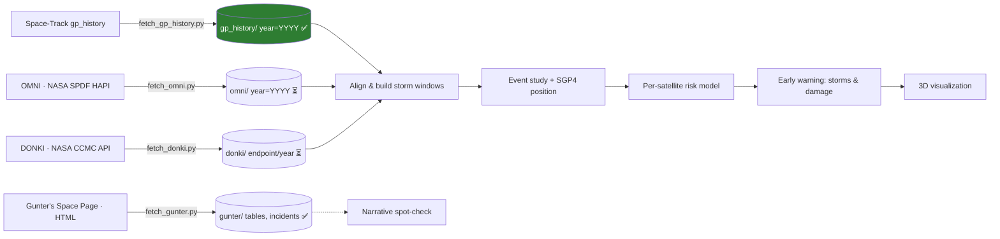

# CME Sentinel

> 🇪🇸 ¿Prefieres leer en español? → [README.es.md](README.es.md)

Historical **coronal mass ejection (CME) → satellite effect** research
project: establishing, from historical records, whether solar eruptions
measurably affect tracked objects and spacecraft — **orbital decay** via
storm-driven atmospheric drag and **electronics failures** — as a first step
toward **early warning** of storm arrivals and **per-satellite damage risk**.

**Current state**

| Stage | Data | Status |
|-------|------|--------|
| 0 | Space-Track `gp_history` orbital catalog (1960 → today) | ✅ downloaded — 67.2M element sets, 63,762 objects, 455 parts, ~12 GB |
| 1 | OMNI hourly solar wind & geomagnetic indices (1963 → today) | ⏳ script ready (`fetch_omni.py`), download pending |
| 2 | DONKI discrete events (CME/GST/SEP/flares/HSS) | ⏳ script ready (`fetch_donki.py`), needs `NASA_API_KEY` |
| 3 | Gunter's Space Page (per-satellite status/failure) | ✅ downloaded — 7.8k canonical pages; tabular export 32,323 rows, unclassified |
| 4 | Combine datasets, event study + SGP4 | ⏳ pending |

---

## Table of contents

- [1. Research goal and causal chain](#1-research-goal-and-causal-chain)
- [2. The data pipeline](#2-the-data-pipeline)
  - [2.1 Pipeline overview](#21-pipeline-overview)
  - [2.2 Stage 0: Space-Track gp_history](#22-stage-0-space-track-gp_history)
  - [2.3 Stage 1: OMNI](#23-stage-1-omni)
  - [2.4 Stage 2: DONKI](#24-stage-2-donki)
  - [2.5 Stage 3: Gunter's](#25-stage-3-gunters)
  - [2.6 Runbook](#26-runbook)
- [3. How we combine the datasets](#3-how-we-combine-the-datasets)
  - [3.1 Alignment keys](#31-alignment-keys)
  - [3.2 Building the event windows](#32-building-the-event-windows)
  - [3.3 Analysis table](#33-analysis-table)
  - [3.4 Validation: Starlink Feb-2022](#34-validation-starlink-feb-2022)
- [4. Reference: the orbital catalog](#4-reference-the-orbital-catalog)
- [5. Excluded and candidate sources](#5-excluded-and-candidate-sources)
- [6. Vision: from evidence to early warning](#6-vision-from-evidence-to-early-warning)
  - [6.1 Predicting storms](#61-predicting-storms)
  - [6.2 Per-satellite damage risk](#62-per-satellite-damage-risk)
  - [6.3 3D visualization](#63-3d-visualization)
  - [6.4 Roadmap and caveats](#64-roadmap-and-caveats)
- [7. Requirements and setup](#7-requirements-and-setup)
- [8. Project layout](#8-project-layout)

---

## 1. Research goal and causal chain

The long-term goal of this repo is to test whether **CMEs causally affect
tracked satellites** and, ultimately, to give **early warning** of two
things:

1. **Storms** — a CME is observed leaving the Sun; we want to predict the
   arrival time and strength (Dst/Kp) of the geomagnetic storm it will
   produce at Earth.
2. **Satellite damage** — which **specific satellites** are at risk: orbital
   decay (drag) and electronics damage (SEP), computed from the satellite's
   position and the forecast storm intensity.

The path to get there is (a) download and align the historical data
(§2–§3), (b) prove the causal relationship with an event study (§3), and
then (c) turn the learned patterns into a predictor and a 3D visualization
(§6).

Two physically distinct pathways connect a CME at the Sun to an effect on a
satellite:

| Pathway | Chain | Observable in the catalog |
|---------|-------|---------------------------|
| Orbit decay | CME → reaches Earth → **geomagnetic storm** (Dst ↓, Kp ↑) → **thermospheric heating / density ↑** → **drag** ↑ → **orbital decay** | `MEAN_MOTION` ↑, `PERIAPSIS` ↓, `DECAY_DATE` set (re-entry) |
| Electronics failure | CME / SEP → **solar energetic particles** reach orbit → radiation damage, **single-event upsets** | telemetry anomalies / loss of signal (not visible in TLEs alone) |

The canonical validation case for the whole pipeline is the **Starlink batch
lost in February 2022**: a CME-driven geomagnetic storm thickened the
thermosphere and ~40 Starlink satellites re-entered within days — visible in
the catalog as clustered `DECAY_DATE`s right after a strong storm.

---

## 2. The data pipeline

Data acquisition is organized in **four stages**, one per source. Each
source plays a fixed role in the causal chain. All collector scripts follow
the same conventions (argparse `--help`, logging, exponential-backoff
retries, resume via `data/.progress.json`, Parquet output partitioned by
year).

### 2.1 Pipeline overview



| n | Source | Role in the chain | Collector | Artifact | Status |
|---|--------|-------------------|-----------|----------|--------|
| 0 | Space-Track `gp_history` | **Effect**: orbital state, drag, decay, re-entry | `fetch_gp_history.py` | `data/gp_history/year=YYYY/` | ✅ |
| 1 | OMNI (NASA SPDF) | **Continuous driver**: solar wind + Dst/Kp/protons | `fetch_omni.py` | `data/omni/year=YYYY/` | ⏳ |
| 2 | DONKI (NASA CCMC) | **Event framework**: CME/GST/SEP/flares + causal chains | `fetch_donki.py` | `data/donki/<endpoint>/year=YYYY/` | ⏳ |
| 3 | Gunter's Space Page | **Narrative layer**: per-satellite status & failure cause | `fetch_gunter.py` (+ `02_gunter_tabular.ipynb`) | `data/gunter/{tables,incidents}.parquet` + raw pages + `gunter_tabular.parquet` | ✅ |

### 2.2 Stage 0: Space-Track gp_history

**What it brings**: the complete historical archive of US Space Force
element sets — one **Orbit Mean-elements Message (CCSDS OMM)** per tracked
object per epoch, **1960-01-01 → today**. 41 columns: orbital elements,
drag/propagation coefficients, mission metadata, and the raw TLE lines
(see the [full data dictionary](#45-data-dictionary-what-every-variable-means)
in §4).

**Role**: the **effect** side of the chain — how orbits respond to storms
(`MEAN_MOTION` ↑, `PERIAPSIS` ↓, `DECAY_DATE` set on re-entry).

**Access**: Space-Track REST API via the `spacetrack` Python package
(login + session + rate limiting). Already downloaded locally:
**67.2M element sets, 63,762 distinct objects, 67 years, ~12 GB** in
455 Parquet parts. This is a "1 / lifetime" dataset: download once, store
locally, never re-run a full download.

### 2.3 Stage 1: OMNI

**Source**: NASA GSFC Space Physics Data Facility, CDAWeb HAPI server,
dataset `OMNI_COHO1HR_MERGED_MAG_PLASMA`
(https://cdaweb.gsfc.nasa.gov/hapi) — DOI `10.48322/6ffx-3441`
(King & Papitashvili). Open data, CC0, no key required.

**What it brings**: 1 row per hour, **1963 → today** (~565,000 rows) — the
continuous geomagnetic/space response that drives the orbital-decay pathway.
IMF (Bx/Bz/Bt), solar wind (speed, density, temperature, pressure), indices
(Dst, Kp, AE/AL/AU, ap, sunspot number, F10.7) and energetic proton fluxes
(>1/>2/>4/>10/>30/>60 MeV):

| EPOCH | BZ_GSM (nT) | BGT (nT) | flow_speed (km/s) | proton_density (#/cm³) | DST (nT) | Kp | AE_INDEX (nT) | P<10MeV_flux |
|---|---|---|---|---|---|---|---|---|
| 2022-02-03 11:00 | −8.2 | 12.5 | 615 | 7.4 | −42 | 37 | 618 | 0.02 |
| 2022-02-03 12:00 | −15.4 | 18.9 | 689 | 9.1 | −85 | 57 | 1248 | 0.04 |
| 2022-02-03 13:00 | −19.8 | 22.1 | 702 | 10.2 | −112 | 73 | 1866 | 0.03 |

*Illustrative rows; the exact parameter set is resolved at runtime from the
HAPI `/info` endpoint.*

**Why this source**: OMNI is the standard 'L1-monopole' dataset used by the
space-weather community: it time-shifts solar-wind measurements to the
Earth's bow-shock nose and stitches in the definitive **Dst**, **Kp** and
**proton flux** indices on the same hourly grid — one table you can join
everything against. It is also the **training signal for storm prediction**
(§6.1).

### 2.4 Stage 2: DONKI

**Source**: NASA public API `https://api.nasa.gov/DONKI/...` (Space Weather
Database Of Notifications, Knowledge, Information). US Government work,
public domain. **Requires a free key** (https://api.nasa.gov) in `.env`:

```dotenv
NASA_API_KEY=your_nasa_api_key_here
```

**What it brings**: 1 row per **event** — the discrete causal framework
(what happened and when). Endpoints fetched: `CME`, `CMEAnalysis`, `GST`,
`FLR`, `SEP`, `IPS`, `HSS`. Records are JSON with nested arrays that the
script flattens into columns (the arrays are also kept serialized as JSON,
so nothing is lost):

| activityID | startTime | sourceLocation | activeRegionNum | cmeAnalyses_speed_3d | cmeAnalyses_count | linked_activity_ids |
|---|---|---|---|---|---|---|
| 2022-02-01T17:00:00-CME-001 | 2022-02-01 17:00 | S24 | 12955 | 708 | 1 | [] |

| gstID | startTime | kpIndex | all_kp_max | linked_activity_ids |
|---|---|---|---|---|
| 2022-02-03T22:00:00-GST-001 | 2022-02-03 22:00 | 6.0 | 6.0 | [2022-02-01T17:00:00-CME-001] |

*(Illustrative rows; `linked_activity_ids` chains CME → GST/SEP for
attribution.)*

**Why this source**: DONKI adds what OMNI cannot — CME catalogs with **3D
direction** (`cmeAnalyses[].speed_3d`, `isEarthDirected`), geomagnetic
storm declarations, SEP/flare events, and the **`linkedEvents` cause→effect
chains**, timestamped in real UTC. It is the **causal core**: it anchors OUR
definition of "a storm happened because of a CME".

### 2.5 Stage 3: Gunter's

**Source**: https://space.skyrocket.de (G. Krebs) — HTML pages, no API.
Curated **secondary** reference: per-satellite status and failure cause,
including free-text comsat-failure narratives.

**What it brings**: the crawler extracts the tabular data and the raw pages
(this repo does **not** classify or build a derived failure dataset — the
narrative is exported as-is for later analysis):

1. **Index tables** → `data/gunter/tables.parquet` (rows scraped from the
   satellite-directory tables):

| satellite | cospar | date | ls | launch vehicle | remarks | source_url |
|---|---|---|---|---|---|---|
| GOES 9 (GOES J) | 1995-025A | 23.05.1995 | CC LC-36B | Atlas-1 | | https://space.skyrocket.de/doc_sdat/goes-i.htm |

2. **Comsat failure narratives** → `data/gunter/incidents.parquet`
   (heading + text pairs from `doc_sat/comsat_failures*` pages):

| satellite | text | source_url |
|---|---|---|
| DirecTV-6 | "…fell victim to a solar flare in April 1997 which knocked out three transponders…" | https://space.skyrocket.de/doc_sat/comsat_failures.htm |

3. **Raw content** → `data/gunter/pages/<page_id>.html` and `.txt`, plus a
   crawl map `data/gunter/meta/pages.parquet` — so future parsing can be
   improved without re-crawling.

**Tabular export (no filtering/classification)** —
`notebooks/02_gunter_tabular.ipynb` (already run) joins everything crawled
into one wide table, **one row per object/launch** from the `#satlist`
registry: `satellite`, `cospar`, `launch_date`, `launch_site`,
`launch_vehicle`, `remarks`, the 11 `#satdata` metadata fields (Nation…
Orbit), the full `#satdescription` prose and `mentions_years` (years cited
in the prose) → `data/gunter/gunter_tabular.parquet` (+ CSV). 32,323 object
rows; COSPAR and raw launch dates allow the fuzzy join to `gp_history` in §3.
The failure *reason* is carried verbatim in `description_text` / `remarks` —
nothing is inferred or categorized here.

**Licensing**: the crawler respects
`https://space.skyrocket.de/robots.txt`, which allows crawling (`Allow: /`)
but declares the site content as `noai`, i.e. **not to be used for training
AI systems**. All derived artifacts are for analysis/research on the project
only. The site requires attribution — carry it in derived files/publications:
> Content © Gunter Dirk Krebs 1996–2026, Gunter's Space Page
> (https://space.skyrocket.de). Used under the site's crawl terms.

**Why this source**: it is the closest thing to a "why did this specific
satellite stop working" record (dates are real but coarse, e.g. "April
1997", and causes are prose) — useful to **illustrate and validate** cases,
not for population-level statistics. It is the narrative extra layer for
the Starlink Feb-2022 validation and a **punctual control** for the §3
analysis, deliberately kept **out** of the core event-study model.

**Known caveats**: the narrative is free prose by a single author — dates
are coarse and causes sometimes speculative (`comsat_failures*` predates
~2004, so later satellites are covered via their own `doc_sdat` page); the
Starlink Feb-2022 loss is **not** narrated by Gunter — it stays a
TLE-validation case only (§3.4).

### 2.6 Runbook

Run the collectors **in stage order** (OMNI first — it is the continuous
driver — then DONKI, then Gunter's, which is the slowest). Every script
resumes safely from `data/.progress.json`; `--reset` is only for
intentional re-downloads. Add `--help` to any script for the full options
list. Test runs: `--limit 1` (OMNI/DONKI) or `--max-pages 10` (Gunter's).

```bash
# Stage 0 (done): orbital catalog
python scripts/fetch_gp_history.py

# Stage 1: OMNI hourly, 1963 → today
python scripts/fetch_omni.py

# Stage 2: DONKI events, 2010 → today (needs NASA_API_KEY)
python scripts/fetch_donki.py

# Stage 3a: Gunter's full-site crawl (resume-safe)
python scripts/fetch_gunter.py

# Stage 3b: build the tabular export (note: already run)
jupyter nbconvert --to notebook --execute --inplace notebooks/02_gunter_tabular.ipynb
```

| Stage | Command | Needs | Output | Expected volume | Expected runtime |
|-------|---------|-------|--------|-----------------|------------------|
| 0 | `fetch_gp_history.py` | Space-Track creds | `data/gp_history/` | ~12 GB | already done |
| 1 | `fetch_omni.py` | none | `data/omni/` | a few hundred MB | minutes–1 h |
| 2 | `fetch_donki.py` | `NASA_API_KEY` | `data/donki/` | a few MB | minutes |
| 3a | `fetch_gunter.py` | none | `data/gunter/` (raw pages + tables/incidents) | ~230 MB | already done (~7.8k pages; ~13k URLs discovered, the rest alias) |
| 3b | `02_gunter_tabular.ipynb` (nbconvert) | reads 3a output | `data/gunter/gunter_tabular.parquet` (+ CSV) | 8 MB / 69 MB | minutes |

Propagated **caveats** (kept in the scripts): the OMNI HAPI host that works
is `cdaweb.gsfc.nasa.gov/hapi` (`spdf.gsfc.nasa.gov/hapi` returns 403); OMNI
fill values (`-1e31`) are converted to `NaN`; each source keeps its own
subfolder under `data/` and its own progress keys (`omni:YYYY`,
`donki:<endpoint>:YYYY`, `gunter:page:<sha1>`).

---

## 3. How we combine the datasets

This is the methodology that turns four separate datasets into one coherent
analysis. The thresholds below are **provisional** — they exist to make the
procedure precise and will be tuned during the analysis phase.

### 3.1 Alignment keys

| Source | Granularity | Key column(s) | What aligns it |
|--------|-------------|---------------|----------------|
| OMNI | 1 h | `EPOCH` | the **master time axis** |
| DONKI | event | `startTime`, `endTime`, `linked_activity_ids` | events on the time axis + CME→GST attribution |
| gp_history | per object per epoch | `EPOCH`, `NORAD_CAT_ID`, `DECAY_DATE` | object state at any time |
| Gunter's | per launch | `cospar`, `date` | map to object via COSPAR/match + launch date (prose) |

`NORAD_CAT_ID` (from gp_history) is the object-level primary key; Gunter's
tables use COSPAR designators and launch dates, so the join to the orbital
catalog is fuzzy (same object via `OBJECT_ID` = COSPAR, or by name + launch
date). ESA's DISCOSweb could later provide an exact object bridge.

### 3.2 Building the event windows

1. **Storm catalog from OMNI** — mark each hourly row as stormy if
   `DST ≤ −50 nT` (magnetic-storm threshold) **or** `Kp ≥ 5` (G-storm
   level); group contiguous stormy hours into events (minimum duration
   3 h, gap tolerance 6 h). Each event gets `storm_id`, `storm_start`,
   `storm_peak` (min Dst / max Kp hour), `dst_min`, `kp_max`.
2. **Fold in DONKI attribution** — match each OMNI storm to a DONKI GST by
   `startTime` within **±24 h**; then follow the GST's
   `linked_activity_ids` back to the **parent CME(s)** (3D cone: speed,
   direction, `isEarthDirected`). SEP events (electronics pathway) are
   matched the same way.
3. **Per-object orbital windows** — for every `NORAD_CAT_ID` with TLEs
   around the storm, define the **event window** `[storm_start − 7 d,
   storm_end + 7 d]` and the **baseline** `[storm_start − 30 d,
   storm_start − 7 d]`. Aggregate `MEAN_MOTION` and `PERIAPSIS` daily per
   object.
4. **Response features** — for each (object, storm): Δ`MEAN_MOTION` and
   Δ`PERIAPSIS` (event average minus baseline average), `decay_in_window`
   flag (`DECAY_DATE` within the event window; remember active objects have
   `DECAY_DATE = ""`, filter with `.astype(str).ne("")`), and
   `hours_peak_to_decay`.
5. **Exact position with SGP4** — propagate each object's **nearest TLE**
   (within ±7 d of the storm peak) to the storm peak with `sgp4` → exact
   position, semi-major axis and perigee at storm time. Record
   `propagator_age_days` (SGP4 error grows with TLE age; Starlink updates
   TLEs ~6×/day, old catalog objects far less often).
6. **Population event study** — fixed-effects OLS (object × storm) of the
   response features against storm intensity (`dst_min`, `kp_max`) and
   drag-sensitive covariates (apogee altitude, inclination). This is the
   causal core of the project.
7. **Narrative control** — for the flagged satellites, look them up in
   Gunter's (`cospar`/`date`) to read/write confirmation in prose; never use
   Gunter's statistics in the model.

### 3.3 Analysis table

The output of §3.2 is one long-format table, **one row per object per
storm**:

| Column | Meaning |
|--------|---------|
| `NORAD_CAT_ID` | object (from gp_history) |
| `storm_id`, `storm_peak_utc` | the OMNI storm event |
| `dst_min`, `kp_max` | storm intensity |
| `cme_activity_id` | parent CME from DONKI (or `None`) |
| `window_start`, `window_end` | event window bounds |
| `delta_mean_motion`, `delta_periapsis` | orbital response |
| `decay_in_window` (bool), `decay_utc` | re-entry in window |
| `sgp4_alt_km`, `sgp4_perigee_km` | exact position at storm peak |
| `propagator_age_days` | TLE age at propagation (SGP4 error proxy) |
| `gunter_hit` | narrative match found on Gunter's (bool) |

This table is also the **feature store** for the risk model in §6.

### 3.4 Validation: Starlink Feb-2022

Validation case that the whole pipeline must reproduce before it is trusted:

- **Event**: CME from ~1–2 Feb 2022 → strong GST on ~3–4 Feb 2022.
  In the downloaded catalog, **75 objects show `DECAY_DATE` in
  February 2022**, including Starlink payloads — the expected cluster.
- **Checks**: the storm must be detected by §3.2 step 1 (`dst_min`/`kp_max`
  extreme); DONKI must attribute a GST to a CME with `isEarthDirected`;
  the decaying objects must have `decay_in_window = True`, high
  Δ`MEAN_MOTION`, starting de-orbiting days before decay.
- **Caveat**: Starlink descends operationally too; the event study needs
  the pre-storm baseline to separate storm-driven decay from routine
  re-entry. Note that Gunter's prose does **not** narrate the Feb-2022
  Starlink loss (it only chronicles individual named satellites), so the
  Starlink validation stays purely TLE-based — Gunter's adds narrative only
  for named cases like Galaxy 15 (2022) and SkyTerra 1 (2012).

---

## 4. Reference: the orbital catalog

All the deep detail about the already-downloaded `gp_history` catalog.

### 4.1 How the data source works

Space-Track.org is the US Space Force / 18th Space Defense Squadron site that
publishes unclassified space situational awareness data. Its REST API:

- **Login**: `POST https://www.space-track.org/ajaxauth/login` with
  `identity` + `password` (form fields). The response sets a session cookie
  that must be sent on subsequent requests.
- **Query**: `GET /basicspacedata/query/class/gp_history/<PREDICATE>.../<format>`
- **Predicates** support operators: `>` (greater than), `<` (less than),
  `--` (range), comma-separated lists, and relative times such as
  `>now-10`. A date range filter is written as `EPOCH/1960-01-01--1960-12-31/`.
- **Formats**: `xml`, `kvn`, `json`, `csv`, `tle`, `3le`, `html`.

The `spacetrack` Python package (used by this project) wraps all of the
above: it performs the login, keeps the session cookie, validates query
predicates, and enforces the **30 requests / minute** rate limit
automatically.

### 4.2 Why the downloader breaks the range into windows

A single API query cannot return the whole archive: the server times out on
huge date ranges, and the API guidelines throttle how fast you may query.
The tool solves that by:

1. Breaking the 1960→today range into **time windows** (small enough that
   each request succeeds).
2. Downloading every window **as CSV** (the most compact format) and
   streaming it **line by line**, so memory usage stays bounded.
3. Automatically **splitting any window that is too big** until it fits.
4. Saving the result as **Parquet partitioned by year**, ready for fast
   analysis with pandas/polars.

No filtering is applied: **everything is downloaded**. Filtering (e.g.
LEO-only, payload-only, decayed objects) can be done later at query time.

### 4.3 Downloader details

Run with:

```bash
python scripts/fetch_gp_history.py
```

- **Login and session** — `SpaceTrackClient(identity, password)` logs in
  lazily on the first request; the script closes the session cleanly.
- **Time windows** — the whole range is divided into contiguous,
  non-overlapping closed intervals. Window size depends on the era:
  1 month (2020→today, Starlink era), 3 months (2016–2019), 6 months
  (2008–2015), 1 year (<2008).
- **Streaming** — each window is requested with `format="csv"`,
  `orderby="EPOCH"`, `iter_lines=True`; lines accumulate into batches of
  `--batch-size` (default 200 000) and each batch is written immediately as
  its own Parquet part: `data/gp_history/year=YYYY/part-<date>-<batch>.parquet`.
  A polite `--min-interval` (default 2 s) sleeps before each request, with
  exponential backoff on transient failures.
- **Auto-subdivision** — a failing window is split in half and retried, down
  to a 1-day minimum (depth 10).
- **Resume** — completed windows are recorded in `data/.progress.json`;
  interrupted runs are skipped on restart. `--reset` ignores saved progress
  (use only intentionally: this is a "1 / lifetime" dataset).
- **Output** — one folder per calendar year, one part per batch, all with
  identical schemas, plus a convenience `year` integer column.

### 4.4 Sample data by era

The five columns `ECCENTRICITY`, `INCLINATION`, `MEAN_MOTION`, `PERIAPSIS`
and `APOAPSIS` are the most useful for a quick glance at how a satellite
moves. Below are **real rows** from the actual downloaded data.

#### 1960 – the dawn of the space age

Only **51 distinct objects** were tracked in 1960 (737 element sets). All of
them are early US probes, launcher upper stages, and their debris.

| EPOCH | OBJECT_NAME | NORAD_CAT_ID | OBJECT_TYPE | OBJECT_ID | COUNTRY | ECCENTRICITY | INCLINATION (°) | MEAN_MOTION (rev/day) | PERIAPSIS (km) | APOAPSIS (km) | LAUNCH_DATE | DECAY_DATE | RCS_SIZE | SITE   |
|-------|-------------|--------------|-------------|-----------|---------|--------------|-----------------|-----------------------|----------------|---------------|-------------|------------|----------|--------|
| 1960-01-01 23:52:39 | VANGUARD R/B | 12 | ROCKET BODY | 1959-001B | US | 0.184 | 32.9 | 11.09 | 554 | 3,681 | 1959-02-17 | | MEDIUM | AFETR |
| 1960-01-02 11:15:40 | JUNO II R/B | 23 | ROCKET BODY | 1959-009B | US | 0.037 | 50.3 | 14.22 | 552 | 1,084 | 1959-10-13 | 1989-07-16 | MEDIUM | AFETR |
| 1960-01-02 12:02:07 | EXPLORER 7 | 22 | PAYLOAD | 1959-009A | US | 0.037 | 50.3 | 14.20 | 560 | 1,087 | 1959-10-13 | | MEDIUM | AFETR |

Note the high eccentricity of the Vanguard upper stage (0.184 → apogee of
3,681 km) and orbits are elliptical; most 1960s objects were still low
inclination (32–50°).

#### 1980 – the cold war catalog

By 1980 the US, USSR (`CIS`), and France (`FR`) were all in space — **4,580
distinct objects** (501,840 rows). Debris fields were growing fast after the
1960s-70s breakup events.

| EPOCH | OBJECT_NAME | NORAD_CAT_ID | OBJECT_TYPE | OBJECT_ID | COUNTRY | ECCENTRICITY | INCLINATION (°) | MEAN_MOTION (rev/day) | PERIAPSIS (km) | APOAPSIS (km) | LAUNCH_DATE | DECAY_DATE | RCS_SIZE | SITE   |
|-------|-------------|--------------|-------------|-----------|---------|--------------|-----------------|-----------------------|----------------|---------------|-------------|------------|----------|--------|
| 1980-01-01 00:00:09 | SCOUT X-3 DEB (YO) | 523 | DEBRIS | 1962-071D | US | 0.005 | 90.5 | 14.84 | 583 | 648 | 1962-12-19 | 1980-11-30 | SMALL | AFWTR |
| 1980-01-01 00:00:18 | DELTA 1 R/B | 3094 | ROCKET BODY | 1968-002B | US | 0.032 | 105.8 | 12.84 | 1,081 | 1,570 | 1968-01-11 | | MEDIUM | AFWTR |
| 1980-01-01 00:01:10 | COSMOS 469 | 5721 | PAYLOAD | 1971-117A | CIS | 0.002 | 64.5 | 13.75 | 966 | 995 | 1971-12-25 | | LARGE | TTMTR |

Notice the near-circular orbits (eccentricities of 0.002–0.032), the
retrograde Delta stage at 105°, and the Soviet `COSMOS` payload — the catalog
is now truly international and includes long-lived debris (SCOUT X-3 debris
was still tracked 18 years after launch).

#### 2010 – the pre-megaconstellation era

2010 holds **14,951 distinct objects** (1,015,278 rows). GEO satellites,
highly-elliptical science missions, and the debris cloud from the 2007
Chinese ASAT test (Fengyun-1C) were all being tracked.

| EPOCH | OBJECT_NAME | NORAD_CAT_ID | OBJECT_TYPE | OBJECT_ID | COUNTRY | ECCENTRICITY | INCLINATION (°) | MEAN_MOTION (rev/day) | PERIAPSIS (km) | APOAPSIS (km) | LAUNCH_DATE | DECAY_DATE | RCS_SIZE | SITE   |
|-------|-------------|--------------|-------------|-----------|---------|--------------|-----------------|-----------------------|----------------|---------------|-------------|------------|----------|--------|
| 2010-01-01 00:00:00 | THEMIS D | 30797 | PAYLOAD | 2007-004D | US | 0.751 | 3.6 | 1.00 | 4,125 | 67,437 | 2007-02-17 | | MEDIUM | AFETR |
| 2010-01-01 00:00:00 | INTELSAT 15 | 36106 | PAYLOAD | 2009-067A | ITSO | 0.000 | 0.0 | 1.01 | 35,664 | 35,688 | 2009-11-30 | | LARGE | TTMTR |
| 2010-01-01 00:00:13 | FENGYUN 1C DEB | 33710 | DEBRIS | 1999-025DGX | PRC | 0.006 | 99.3 | 13.98 | 856 | 947 | 1999-05-10 | | SMALL | TSC |

This era has it all: a highly-elliptical science orbit (THEMIS D:
eccentricity 0.75, apogee ~67,000 km), a **geostationary** satellite at
35,700 km with `MEAN_MOTION ≈ 1 rev/day`, and debris from the Fengyun-1C ASAT
test (Chinese `PRC` designation).

#### 2024 – the Starlink era

By 2024 the catalog exploded to **29,814 distinct objects** (6.36 million
rows). Most new objects are Starlink payloads — small, near-circular LEO
satellites launched only months before.

| EPOCH | OBJECT_NAME | NORAD_CAT_ID | OBJECT_TYPE | OBJECT_ID | COUNTRY | ECCENTRICITY | INCLINATION (°) | MEAN_MOTION (rev/day) | PERIAPSIS (km) | APOAPSIS (km) | LAUNCH_DATE | DECAY_DATE | RCS_SIZE | SITE   |
|-------|-------------|--------------|-------------|-----------|---------|--------------|-----------------|-----------------------|----------------|---------------|-------------|------------|----------|--------|
| 2024-01-01 00:00:00 | STARLINK-6068 | 56798 | PAYLOAD | 2023-078AH | US | 0.000 | 70.0 | 14.98 | 570 | 574 | 2023-05-31 | | LARGE | AFWTR |
| 2024-01-01 00:00:00 | STARLINK-30550 | 58045 | PAYLOAD | 2023-156T | US | 0.000 | 53.0 | 15.92 | 296 | 298 | 2023-10-09 | | LARGE | AFWTR |
| 2024-01-01 00:00:00 | STARLINK-30951 | 58439 | PAYLOAD | 2023-183C | US | 0.000 | 43.0 | 15.26 | 487 | 489 | 2023-11-28 | | LARGE | AFETR |

Starlink sats are essentially circular (eccentricity ~0.0001-0.0003), at
various shell inclinations (43°, 53°, 70°), with mean motions of 15–16
rev/day (periods around 90–96 minutes) and altitudes of roughly 300–600 km.

### 4.5 Data dictionary (what every variable means)

Every row in the catalog is one **Orbit Mean-elements Message (CCSDS OMM)**:
a snapshot of one object's orbit at `EPOCH`. The 41 columns fall into eight
semantic groups.

**1. Object identification**

| Column | Parquet type | Meaning |
|--------|--------------|---------|
| `OBJECT_NAME` | string | Public common name, e.g. `ISS (ZARYA)`, `STARLINK-6068`, `COSMOS 469`. |
| `OBJECT_ID` | string | International designator (COSPAR): `YYYY-NNNx`, e.g. `1998-067A`. |
| `NORAD_CAT_ID` | int | Unique **catalog number** issued by US Space Force (e.g. 25544 = ISS). Primary key of the object. |
| `OBJECT_TYPE` | string | `PAYLOAD`, `ROCKET BODY`, `DEBRIS`, `TBA`/`UNKNOWN`. |
| `CLASSIFICATION_TYPE` | string | Security classification, almost always `U` (unclassified). |

**2. Classic orbital elements** — with `EPOCH` and these five they fully
define the state; `MEAN_ANOMALY` is the "where along the orbit" parameter.

| Column | Parquet type | Meaning |
|--------|--------------|---------|
| `EPOCH` | datetime (UTC) | **Time of the element set** — the instant these elements are valid. |
| `MEAN_MOTION` | float | **Mean motion**, rev/day. ~15.9 = ISS (LEO), ~1.0 = GEO, ~14.8 = Starlink. |
| `ECCENTRICITY` | float | **Orbital eccentricity**, 0 = perfect circle. |
| `INCLINATION` | float | **Inclination**, degrees. 0° = equatorial, 51.6° = ISS, 97°+ = Sun-synchronous, >90° = retrograde. |
| `RA_OF_ASC_NODE` | float | **Right ascension of the ascending node**, degrees (0–360). |
| `ARG_OF_PERICENTER` | float | **Argument of perigee**, degrees (0–360). |
| `MEAN_ANOMALY` | float | **Mean anomaly**, degrees (0–360) — where along the ellipse at epoch. |

**3. SGP4 propagation coefficients**

| Column | Parquet type | Meaning |
|--------|--------------|---------|
| `BSTAR` | float | **Drag / radiation-pressure coefficient** (1/earth-radii). Negative values indicate radiation pressure. |
| `MEAN_MOTION_DOT` | float | First derivative of mean motion, rev/day² (orbit shrinking rate). |
| `MEAN_MOTION_DDOT` | float | Second derivative of mean motion, rev/day³ (nearly always 0). |
| `EPHEMERIS_TYPE` | int | Ephemeris model used in generation (0 = SGP4 in practice). |
| `ELEMENT_SET_NO` | int | Revision number of this element set for the object. |
| `REV_AT_EPOCH` | int | **Orbit number at epoch** — full revs since launch. |

**4. Derived orbital parameters** (computed by Space-Track)

| Column | Parquet type | Meaning |
|--------|--------------|---------|
| `SEMIMAJOR_AXIS` | float | **Semi-major axis**, km. |
| `PERIOD` | float | **Orbital period**, minutes. ~90–96 min LEO, 1436 min GEO. |
| `APOAPSIS` | float | **Apogee altitude**, km above sea level. |
| `PERIAPSIS` | float | **Perigee altitude**, km above sea level. Perigee ≤ 2,000 km ≈ LEO. |

**5. Mission metadata**

| Column | Parquet type | Meaning |
|--------|--------------|---------|
| `LAUNCH_DATE` | string (`YYYY-MM-DD`) | When the object's launch vehicle lifted off. |
| `DECAY_DATE` | string (`YYYY-MM-DD`) | When the object re-entered (**blank `""` if still on orbit**). |
| `SITE` | string | Launch site code, e.g. `AFETR`, `AFWTR`, `TTMTR`, `TSC`. |
| `COUNTRY_CODE` | string | Country/organization, e.g. `US`, `CIS`, `PRC`, `ITSO`. |
| `RCS_SIZE` | string | Radar cross-section class: `SMALL`, `MEDIUM`, `LARGE`. |

**6. API / data-frame metadata**

| Column | Parquet type | Meaning |
|--------|--------------|---------|
| `CCSDS_OMM_VERS` | string | OMM format version (e.g. `3.0`). |
| `COMMENT` | string | Free-text comment, e.g. `GENERATED VIA SPACE-TRACK.ORG API`. |
| `CREATION_DATE` | datetime (UTC) | When 18 SPCS generated/published this element set. |
| `ORIGINATOR` | string | Creating agency, e.g. `18 SPCS`. |
| `CENTER_NAME` | string | Central body, `EARTH`. |
| `REF_FRAME` | string | Reference frame, `TEME`. |
| `TIME_SYSTEM` | string | Time system, `UTC`. |
| `MEAN_ELEMENT_THEORY` | string | Propagator theory, `SGP4`. |
| `FILE` | int | Source file ID of the upload on Space-Track (higher = more recent batch). |
| `GP_ID` | int | **Unique row identifier** in the GP archive. |

**7. Raw TLE lines** (exact string form, best for your own SGP4 propagation)

| Column | Parquet type | Meaning |
|--------|--------------|---------|
| `TLE_LINE0` | string | Line 0: the object name line (`0 NAME`). |
| `TLE_LINE1` | string | Catalog number, classification, epoch data, drag terms, element set no, checksum. |
| `TLE_LINE2` | string | Inclination, RAAN, eccentricity (squashed), arg perigee, mean anomaly, mean motion, checksum. |

**8. Partition column**

| Column | Parquet type | Meaning |
|--------|--------------|---------|
| `year` | int | Convenience column added by the downloader, equal to `EPOCH`'s year. |

In the Parquet files the numeric columns are stored as 64-bit floats / Int64
(nullable) integers and `EPOCH` / `CREATION_DATE` as timezone-aware
`datetime64[ns, UTC]`. Timestamp precision may alternate between microseconds
and milliseconds across year boundaries; both unify cleanly on read.

### 4.6 Reading the data

```python
import pandas as pd

# Read the whole catalog as one DataFrame (may take a while / a lot of RAM
# for the full history). For large analysis, read one year at a time.
df = pd.read_parquet("data/gp_history")
df_2024 = pd.read_parquet("data/gp_history/year=2024")

# Latest elset of the ISS:
iss = df[df["NORAD_CAT_ID"] == 25544].sort_values("EPOCH").tail(1)

# LEO example (perigee below 2000 km):
leo = df[df["PERIAPSIS"] <= 2000.0]

# Only Starlink payloads:
starlink = df[df["OBJECT_NAME"].str.startswith("STARLINK")]

# Only active (non-decayed) objects: DECAY_DATE is "" for active objects
# (see §3.2 step 4), so:
active = df[df["DECAY_DATE"].astype(str).ne("")]
```

The other datasets read the same way:

```python
omni = pd.read_parquet("data/omni")              # hourly solar wind + indices
donki_cme = pd.read_parquet("data/donki/CME")    # one row per CME
donki_gst = pd.read_parquet("data/donki/GST")    # one row per storm
gunter_tables = pd.read_parquet("data/gunter/tables.parquet")
gunter_incidents = pd.read_parquet("data/gunter/incidents.parquet")
gunter_tables = pd.read_parquet("data/gunter/tables.parquet")
gunter_incidents = pd.read_parquet("data/gunter/incidents.parquet")

# Tabular export (1 row per object, no classification), from 02_gunter_tabular.ipynb:
gunter_tabular = pd.read_parquet("data/gunter/gunter_tabular.parquet")
```

### 4.7 Verification

```bash
python - <<'EOF'
import pandas as pd
df = pd.read_parquet("data/gp_history")
print(df.groupby("year")["NORAD_CAT_ID"].count())          # rows per year
print(df.groupby("year")["EPOCH"].agg(["min", "max"]))     # coverage per year
print(df.groupby("year")["NORAD_CAT_ID"].nunique().max())  # distinct objects
EOF
```

Optional deep check: recompute the modulo-10 checksum of `TLE_LINE1`/
`TLE_LINE2` to confirm raw-TLE integrity (Space-Track assigns 0 to
letters/blanks/`.`/`+` and 1 to `-`).

### 4.8 Considerations, rate limits and policy

- **Volume**: the full archive is **~138M+ element sets** → dozens of GB of
  Parquet, and a download that may take **hours to a few days**. The current
  local download is **67.2M rows / ~12 GB**.
- **API throttle**: Space-Track limits you to **<30 requests/minute** and
  **<300 requests/hour**. The `spacetrack` client enforces the per-minute
  limit; the script is designed so the total request count stays well below
  300 (one request per window).
- **Data class policy**: the guidelines label `GP_HISTORY` as
  "1 / lifetime" — download once and **store it on your own servers** (which
  is exactly what this project does). Do not re-run full downloads; `--reset`
  should only be used intentionally.
- **Recommended**: before a huge bulk download, contact
  [Space-Track](https://www.space-track.org/documentation) (Contact Us) to
  announce your plan and confirm acceptable usage.
- **Re-distribution**: USSPACECOM provides blanket approval to redistribute
  basic SSA data with appropriate citation (`USSPACECOM/18 SDS`).
- **Time zone**: all timestamps are **UTC**.

---

## 5. Excluded and candidate sources

### 5.1 ESA Anomaly Dataset (documented reference, excluded)

The [ESA Anomaly Dataset](https://github.com/esa/anomaly-dataset) is the first
large-scale dataset of **real satellite telemetry** (housekeeping: currents,
voltages, temperatures, states) with **anomaly annotations curated by ESA
mission-operations engineers**. It was produced by Airbus Defence and Space,
KP Labs and ESA/ESOC under the A²I roadmap.

- Data: Zenodo `10.5281/zenodo.12528696` (3 zips, ~11.6 GB)
- Paper: arXiv [`2406.17826`](https://arxiv.org/abs/2406.17826); journal
  version [DMLR](https://data.mlr.press/assets/pdf/v03-23.pdf)
- Benchmark code: [`kplabs-pl/ESA-ADB`](https://github.com/kplabs-pl/ESA-ADB)
  (TimeEval-based pipeline; Kaggle: `esa-adb-challenge`)

| | Mission1 | Mission2 | Mission3 |
|---|---|---|---|
| Channels (target) | 76 (58) | 100 (47) | 48 (24) |
| Telecommands | 698 | 123 | 0 |
| Duration (anonymised) | 14 y | 3.5 y | 8 y |
| Data points | ~775 M | ~777 M | ~745 M |
| Annotated (%) | 1.80 | 0.58 | 1.03 |
| Events | 200 | 644 | 586 |
| Anomalies | 118 | 31 | 8 |
| Rare nominal events | 78 | 613 | 25 |
| Gaps / invalid | 4 / 0 | 0 / 0 | 397 / 156 |

Each mission folder ships `channels/<param>.zip` (per-channel time series),
`telecommands/<tc>.zip`, `labels.csv` and `anomaly_types.csv` (`Anomaly` /
`Rare Event` / `Gap`). Mission3 is excluded from the benchmark upstream
(trivial anomalies).

> **Why it is not in the causal pipeline**: the dataset is fully anonymised —
> channel names, mission identity **and the time axis**. The paper states the
> anonymisation *prevents expecting anomalies at specific times, e.g. during
> increased solar activity*. Because the timestamps cannot be aligned with
> DONKI/OMNI storm times, this dataset **cannot** contribute to the CME
> correlation study. It is documented here as the reference benchmark for
> spacecraft-telemetry anomaly detection, in case a telemetry-anomaly module
> is ever added.

### 5.2 Satellite status & failure reason (extra layers)

| Source | Adds | Role |
|--------|------|------|
| **Gunter's Space Page** (`space.skyrocket.de`) | Per-satellite **status and failure cause** (e.g. "failed in 1998 due to momentum wheel problems") | Narrative layer for targeted validation (see §2.5, §3.4) |
| **DISCOSweb** (ESA) | Object metadata + `reentryEpoch`, launches, fragmentations, re-entries | REST API (account) — complements Space-Track object metadata and could be an exact COSPAR↔NORAD bridge |
| **UCS Satellite Database** | Current operational status (Operational / Non-operational) | Snapshot of "alive today", no failure history |

Space-weather attribution itself comes from **DONKI (GST/SEP) + OMNI
(Dst/Kp/protons) + decay events in Space-Track**; these layers only answer
"why did this specific satellite stop working".

### 5.3 Candidate historical catalogs (scoped, not adopted)

| Catalog | Coverage | Note |
|---------|----------|------|
| CDAW/SOHO-LASCO CME | 1996+ | Long-running CME catalog |
| CACTus (SOHO) | 1997–2017 | Automated CME detection |
| HELCATS (STEREO) | 2007–2017 | 3D CME tracking from twin STEREO |

DONKI/OMNI were chosen as the core because DONKI adds real 3D direction plus
SEP/GST events and causal chains, and OMNI carries the continuous
Dst/Kp/proton series.

---

## 6. Vision: from evidence to early warning

The data pipeline and event study (§2–§3) establish **historical causation**.
The next step is to turn that evidence into a **predictive early-warning
system** and a **3D visualization**. These are explicitly the goals of the
project going forward.

### 6.1 Predicting storms

Using a CME as soon as it is observed (DONKI CME/CMEAnalysis records; in
operation, also coronagraph/L1 imagery), predict the storm it will cause at
Earth:

- **Arrival time** — from CME speed/direction (3D cone: `speed_3d`,
  `isEarthDirected`) and transit models tuned against the historical OMNI
  arrival lags (CME launch → Kp/Dst onset).
- **Strength** — forecast `dst_min` / `kp_max` buckets from the CME's energy
  and the historical OMNI response, using the same storm definition as §3.2
  (`Dst ≤ −50` or `Kp ≥ 5`).

The OMNI series is both the training signal and the verification target for
these forecasts.

### 6.2 Per-satellite damage risk

From the event-study coefficients (§3) and each satellite's live orbital
state from `gp_history`:

- **Drag / decay risk** — a per-satellite probability of re-entry given the
  forecast storm: objects with low apogee altitudes and drag-sensitive
  shells (Starlink-class LEO) get high scores; GEO objects get ~0.
- **Electronics risk** — a SEP-driven flag for objects whose orbit intersects
  the energetic-particle flux peaks (protons from OMNI, SEP events from
  DONKI).

The §3.3 analysis table is the **feature store** this risk model is trained
and evaluated on (supervised on `decay_in_window` and Gunter's-confirmed
failures).

### 6.3 3D visualization

An interactive 3D view of the whole system, replayable for historical
events and usable live:

- **Earth + satellite fleet** — every tracked object (or a filtered subset)
  drawn from its TLEs via SGP4 propagation (already a pinned dependency).
- **Storm front** — the CME / solar-wind structure propagating from the Sun
  to Earth (DONKI 3D cone + OMNI arrival), with the storm window marked.
- **At-risk highlighting** — objects flagged by §6.2 glow/color by risk;
  clicking shows their risk factors and the Gunter's narrative (§2.5) when
  available.
- **Time slider** — play back events; the first canonical replay is the
  **Starlink Feb-2022** cluster from §3.4.

Candidate tooling: `plotly` (Python, easy 3D scatter + slider) and/or
`three.js` (web deploy; procedural Earth + orbit lines).

### 6.4 Roadmap and caveats

1. ✅ Stage 0 data (`gp_history`) — done.
2. ⏳ Stages 1–2 data (OMNI/DONKI) — collectors ready, run them (§2.6).
   ✅ Stage 3 (Gunter's) — crawled, tabular export built (unclassified).
3. ⏳ §3 pipeline — storm windows, SGP4, event study, Starlink validation.
4. 🚧 §6.1–6.2 — train predictors on the event-study features.
5. 🧭 §6.3 — 3D visualization MVP (historical replay), then live views.

**Caveats**: demonstrating historical correlation (§3) is **not** the same
as operational prediction (§6) — that needs a live feed of CME/OMNI data
and careful evaluation out-of-sample. The repository only holds historical,
batch data today. SGP4-based positions carry the TLE-age error discussed in
§3.2; the risk model inherits it and should record `propagator_age_days`.

---

## 7. Requirements and setup

### Requirements

- Python **3.10+** (the repo pins 3.14).
- A registered, approved **Space-Track.org account** (Stage 0; already spent).
- A free **NASA API key** (Stage 2, DONKI). The server ships a `DEMO_KEY`
  fallback, but it is heavily rate-limited.
- Enough disk space for the full history (see
  [Considerations](#48-considerations-rate-limits-and-policy)).

### Setup

```bash
# 1. Create your virtual environment (if not already present) and activate it.
python -m venv .venv
source .venv/bin/activate

# 2. Install dependencies.
pip install -r requirements.txt

# 3. Provide your credentials.
cp .env.example .env      # then edit .env
```

`.env` must contain:

```dotenv
SPACE_TRACK_EMAIL=your_email@example.com
SPACE_TRACK_PASSWORD=your_password_here
NASA_API_KEY=your_nasa_api_key_here        # needed for fetch_donki.py
```

> Note: `.env` and `data/` are already git-ignored, so credentials and
> downloaded raw data will never be committed.

---

## 8. Project layout

```
cme-sentinel/
├── .env                     # credentials (git-ignored)
├── .env.example             # template for the credentials file
├── AGENTS.md                # project instructions for AI agents (Spanish)
├── README.md                # this document (English, source of truth)
├── README.es.md             # Spanish translation of the README
├── docs/
│   └── proceso_extraccion_gunter.md  # step-by-step account of the Gunter's extraction
├── requirements.txt          # Python dependencies
├── scripts/
│   ├── fetch_gp_history.py  # Stage 0: orbital catalog (already run)
│   ├── fetch_omni.py        # Stage 1: OMNI hourly solar wind & indices (ready, not run)
│   ├── fetch_donki.py       # Stage 2: DONKI events (ready, needs NASA_API_KEY)
│   ├── fetch_gunter.py      # Stage 3a: Gunter's full-site crawl (already run)
├── notebooks/
│   ├── 01_validate_and_explore.ipynb  # catalog validation & exploration
│   └── 02_gunter_tabular.ipynb        # Gunter's wide tabular export (run)
└── data/
    ├── .progress.json       # download progress (git-ignored)
    ├── gp_history/          # Stage 0 ✅ (git-ignored)
    ├── omni/                # Stage 1 (git-ignored)
    ├── donki/               # Stage 2 (git-ignored)
    └── gunter/              # Stage 3 ✅ (git-ignored)
        ├── tables.parquet       # directory index rows
        ├── incidents.parquet    # comsat_failures narratives
        ├── gunter_tabular.parquet  # one row per object, no classification (with .csv)
        ├── meta/pages.parquet   # crawl map (canonical pages)
        └── pages/               # raw HTML + TXT per page
```